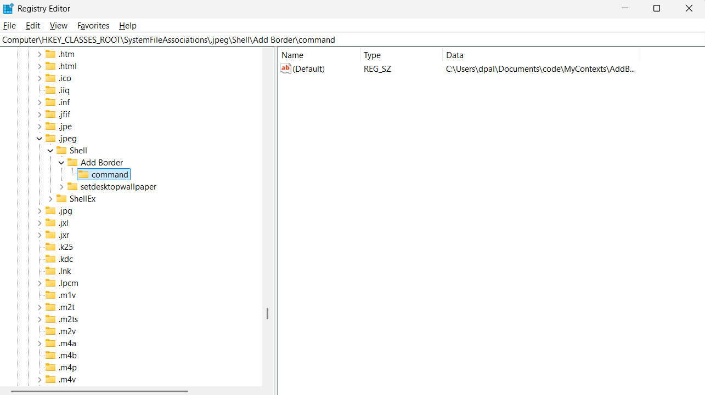

Here is an example on how to configure windows registry to active your custom program for specific filetype

Goto the specific filetype, create a new default key and command key

`Computer\HKEY_CLASSES_ROOT\SystemFileAssociations\.arw\shell\Convert To JPG\command`

value for the command key should be like this:

`"C:\Users\dpal\Documents\code\MyContexts\ConvertRAW.bat" "%1"`

